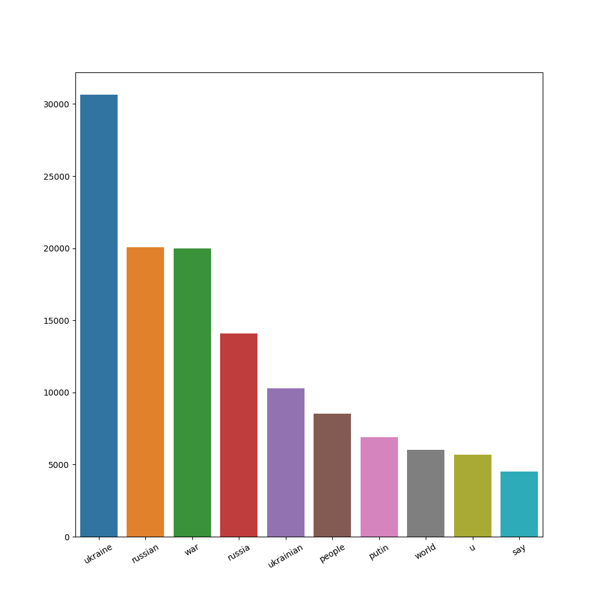
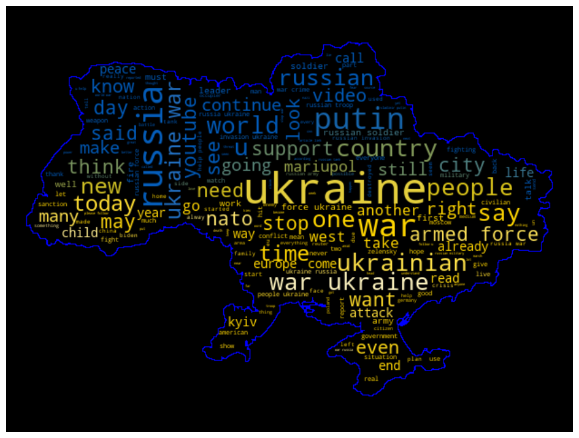
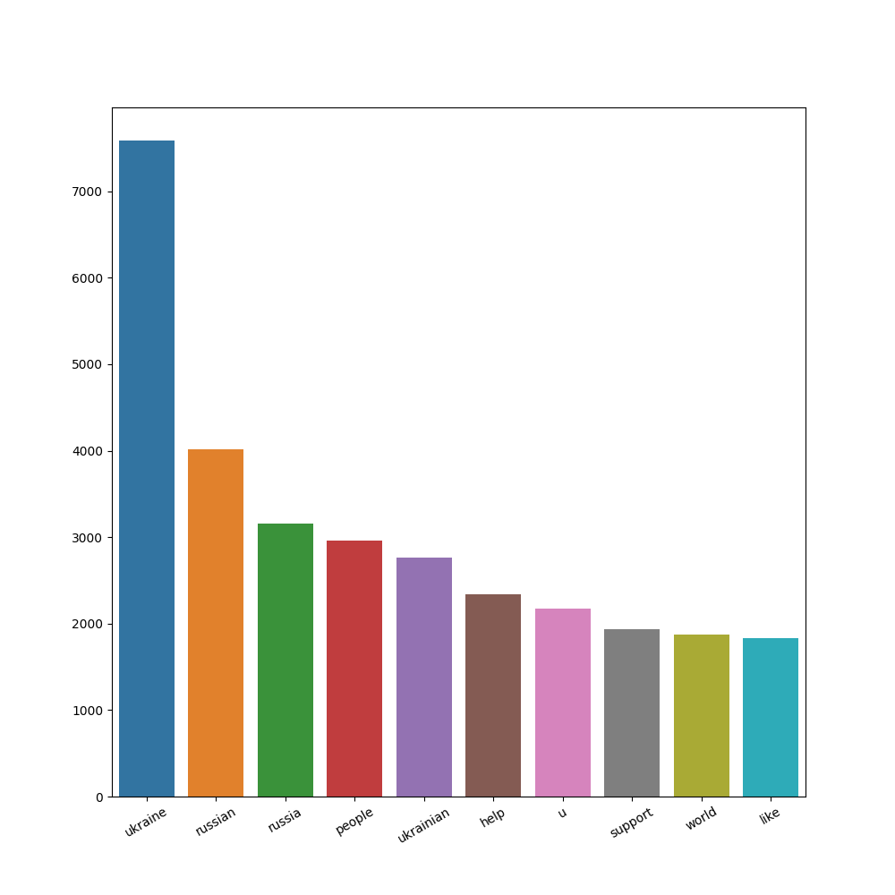
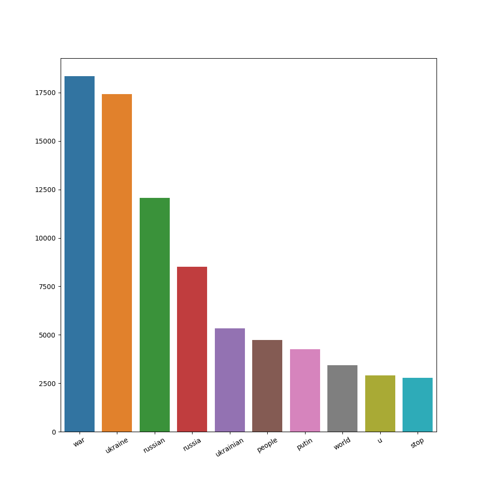
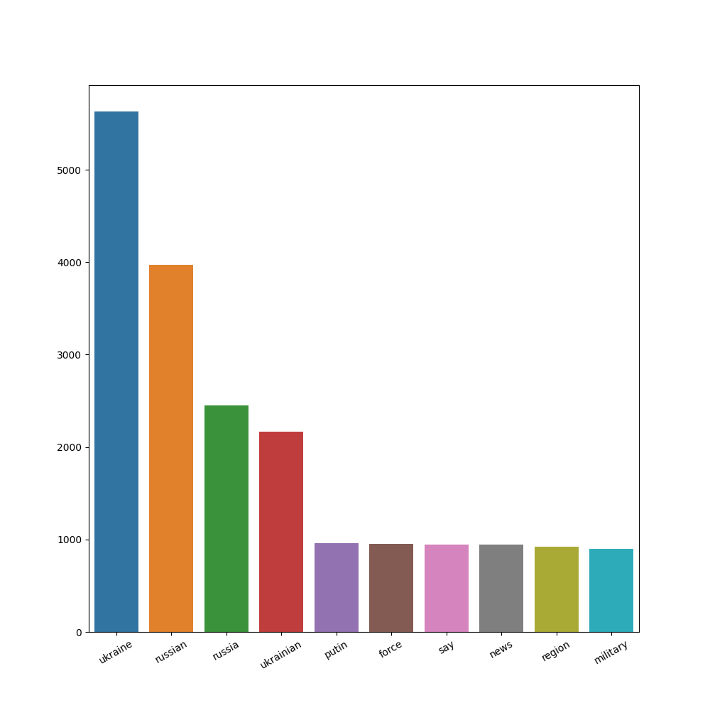

# Analiza Tweetów z hasztagami: "#war #ukraine"

## Dane
<p>Zebrano tweety od <b>2022-01-01</b> do <b>2022-06-14</b>. Zachowano wyłacznie tweety, których język był oznaczony jako angielski. Łączona liczba uzyskanych tweetów: <b>110845</b></p>

```python
scraper = snscrape.modules.twitter.TwitterSearchScraper('#ukraine #war” since:2022-01-01')
for i, tweet in enumerate(scraper.get_items()):
    if (tweet.lang == "en"):
        tweets.append({"content": tweet.content, "date": tweet.date})

with open("tweets.json", "w") as f:
    f.write(json.dumps(tweets, indent=4, default=str))
```

## Obróbka danych
<p>Z Każdego tweeta usunięto znaki specialne, a następnie poddano tokenizacji, filtracji oraz lematyzacja. Efekty te zostały uzyskane za pomocą biblioteki nltk.</p>

```python
content = tweet["content"]
string_encode = content.encode("ascii", "ignore")
string_decode = string_encode.decode()
tweet_list = string_decode.split()
tokenized = word_tokenize(' '.join(tweet_list))
tokenized = list(map(lambda word: word.lower().strip(), tokenized))
filtered = filter_words(tokenized, stop_words)
lem = lemmatize_words(filtered)
```

## Rozkład częstotliwości słów
<p>Odpowiednio przygotowane tweety zostały połączone w jeden duży tekst, w którym sprawdzony częstotliwość występowania słów. Poniższy wykres przestawia 10 najczęściej pojawiających się słów.</p>

 <br/>
 <br/>

## Analiza opinii
<p>Przeprowadzono analizę opinii ("sentymentu") z wykorzystaniem modułu Vader z biblioteki nltk. Analizie poddany został każdy twett z osobna jak i całość tekstu. </p>

```python
sid = SentimentIntensityAnalyzer()
ss = sid.polarity_scores(tweet_text)
#...
ss_all = sid.polarity_scores(' '.join(text))
```

### Wyniki
- {'neg': 0.242, 'neu': 0.618, 'pos': 0.14, 'compound': -1.0}
- Negatywne: 55919
- Neutralne: 25794
- Pozytywne: 29132 

<p>Narzędzie zakwalifikowało całość tweetów jako wypowiedzi negatywne na tematy związane z hasztagami #war #ukraine</p>

### Słowa pozytywne
 <br/>

### Słowa negatywne
 <br/>

### Słowa neutralne
 <br/>


## Opinie w ramach czasowych
<p>Zmiany oceny opinii w podzial na miesiące</p>

- Styczeń:
    - Neg: 663, Neu: 251, Pos: 322
    - {'neg': 0.25, 'neu': 0.623, 'pos': 0.127, 'compound': -1.0}
- Luty:
    - Neg: 9410, Neu: 4502, Pos: 5402
    - {'neg': 0.25, 'neu': 0.587, 'pos': 0.163, 'compound': -1.0}
- Marzec:
    - Neg: 20525, Neu: 9509, Pos: 10589
    - {'neg': 0.249, 'neu': 0.613, 'pos': 0.138, 'compound': -1.0}
- Kwiecień:
    - Neg: 13421, Neu: 6434, Pos: 6655
    - {'neg': 0.236, 'neu': 0.635, 'pos': 0.129, 'compound': -1.0}
- Maj:
    - Neg: 9091, Neu: 4053, Pos: 4744
    - {'neg': 0.232, 'neu': 0.638, 'pos': 0.13, 'compound': -1.0}
- Czerwiec:
    - Neg: 2809, Neu: 1045, Pos: 1420
    - {'neg': 0.233, 'neu': 0.628, 'pos': 0.139, 'compound': -1.0}

<b>Widać iż ogólna ocena nie zmienia się w czasie, lecz występują niewielkie fluktuacje w poszczegolnych kategoriach.</b>

## Wydarzenia a liczba tweetów
<p>Przeprowadzono zliczenie ilości tweetów w odstępach czasowych: "dzień", "tydzień", "miesiąc". <br />
</p>

### Dni z największą liczbą tweetów
- 2022-02-24: 4718
- 2022-02-27: 2840
- 2022-02-26: 2776
- 2022-02-28: 2422

### Tygodnie z największą liczbą tweetów
- 2022-02-21_2022-02-27: 14885
- 2022-02-28_2022-03-06: 13758
- 2022-03-07_2022-03-13: 9080
- 2022-03-14_2022-03-20: 8821

### Miesiące
- 03: 40623
- 04: 26510
- 02: 19314
- 05: 17888
- 06: 5274
- 01: 1236

<b>Wniosek: Najwięcej tweetów danego dnia pojawiło się w momencie rozpoczęcia inwazji Rosji na Ukrainę 24 lutego 2022 roku. Ogólne maksimum liczby nowych tweetów przypada na okres od połowy lutego do końca marca.</b>

